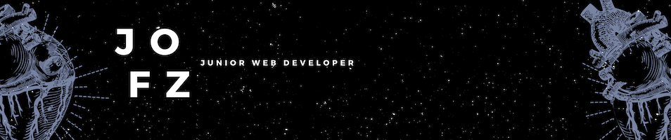

## Hi there, I'm **Jo** 
   
### I am a newbie in this Big Tech World

### **Seriousness** and a lot of The Office(US) humor characterize me

While at first glance my career journey seem unrelated each experience is connected to progress related to my core values : pedagogy, personal questioning and a balance of rigor and creativity. My curiosity and dedication to growth have been a key factor in both the formal and self taught education I have consistently pursued over the past decade. 
I aspire to work for a company with strong values ​​and to develop applications that have a positive impact on people.

* 👨‍💻 I’m currently working on these Skills : HTML5 / CSS3 / PHP / JS 
* 📖 Next I would like to learn React or Vue
* 🔭 Next to the next humbly become a (good) developer never stop to learn

